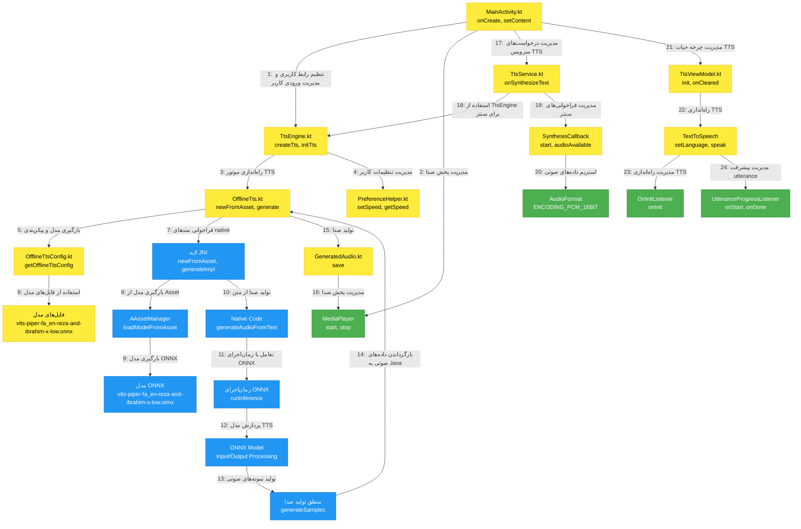

```mermaid
graph TD
    %% Android Parts (Green)
    C[MediaPlayer<br>start, stop]:::android
    K[AudioFormat<br>ENCODING_PCM_16BIT]:::android
    N[OnInitListener<br>onInit]:::android
    O[UtteranceProgressListener<br>onStart, onDone]:::android

    %% Kotlin Parts (Yellow)
    A[MainActivity.kt<br>onCreate, setContent]:::kotlin -->|1: تنظیم رابط کاربری و مدیریت ورودی کاربر| B[TtsEngine.kt<br>createTts, initTts]:::kotlin
    A:::kotlin -->|2: مدیریت پخش صدا| C:::android
    B:::kotlin -->|3: راه‌اندازی موتور TTS| D[OfflineTts.kt<br>newFromAsset, generate]:::kotlin
    B:::kotlin -->|4: مدیریت تنظیمات کاربر| E[PreferenceHelper.kt<br>setSpeed, getSpeed]:::kotlin
    D:::kotlin -->|5: بارگیری مدل و پیکربندی| G[OfflineTtsConfig.kt<br>getOfflineTtsConfig]:::kotlin
    G:::kotlin -->|6: استفاده از فایل‌های مدل| H[فایل‌های مدل<br>vits-piper-fa_en-reza-and-ibrahim-x-low.onnx]:::kotlin
    D:::kotlin -->|7: فراخوانی متدهای native| P[لایه JNI<br>newFromAsset, generateImpl]:::jni
    P:::jni -->|8: بارگیری مدل از Asset| V[AAssetManager<br>loadModelFromAsset]:::jni
    V:::jni -->|9: بارگیری مدل ONNX| S[مدل ONNX<br>vits-piper-fa_en-reza-and-ibrahim-x-low.onnx]:::jni
    P:::jni -->|10: تولید صدا از متن| W[Native Code<br>generateAudioFromText]:::jni
    W:::jni -->|11: تعامل با زمان‌اجرای ONNX| R[زمان‌اجرای ONNX<br>runInference]:::jni
    R:::jni -->|12: پردازش مدل TTS| Y[ONNX Model<br>Input/Output Processing]:::jni
    Y:::jni -->|13: تولید نمونه‌های صوتی| T[منطق تولید صدا<br>generateSamples]:::jni
    T:::jni -->|14: بازگرداندن داده‌های صوتی به Java| D:::kotlin
    D:::kotlin -->|15: تولید صدا| F[GeneratedAudio.kt<br>save]:::kotlin
    F:::kotlin -->|16: مدیریت پخش صدا| C:::android
    A:::kotlin -->|17: مدیریت درخواست‌های سرویس TTS| I[TtsService.kt<br>onSynthesizeText]:::kotlin
    I:::kotlin -->|18: استفاده از TtsEngine برای سنتز| B:::kotlin
    I:::kotlin -->|19: مدیریت فراخوانی‌های سنتز| J[SynthesisCallback<br>start, audioAvailable]:::kotlin
    J:::kotlin -->|20: استریم داده‌های صوتی| K:::android
    A:::kotlin -->|21: مدیریت چرخه حیات TTS| L[TtsViewModel.kt<br>init, onCleared]:::kotlin
    L:::kotlin -->|22: راه‌اندازی TTS| M[TextToSpeech<br>setLanguage, speak]:::kotlin
    M:::kotlin -->|23: مدیریت راه‌اندازی TTS| N:::android
    M:::kotlin -->|24: مدیریت پیشرفت utterance| O:::android

    %% Style Definitions
    classDef android fill:#4CAF50,stroke:#388E3C,color:#FFFFFF;
    classDef kotlin fill:#FFEB3B,stroke:#FBC02D,color:#000000;
    classDef jni fill:#2196F3,stroke:#1976D2,color:#FFFFFF;
```
